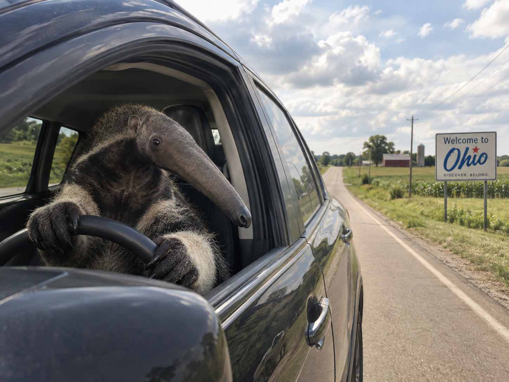

# Oskar Phonkdagar Is From Ohio

## An Anteater Takes the Wheel

There are many ways to cross Ohio, but few make an impression quite like an anteater behind the wheel. Picture a quiet country road, a ribbon of pavement between fields, and a driver whose snout reaches toward the windshield before the rest of him has finished settling into the seat. The scene is impossible, of course. That is precisely why it deserves a road trip.

For our fictional anteater, driving begins with a question of proportions. Cars are designed around human assumptions: short noses, convenient fingers, and tails that do not exist. An anteater challenges the entire arrangement. The rearview mirror becomes an obstacle, the seat requires negotiation, and parallel parking turns into a philosophical disagreement between the vehicle and its occupant. Yet he approaches the task with the solemn confidence of someone who has never once doubted his right to merge.

Ohio supplies the perfect stage. The road carries him past fields, barns, and a welcome sign that seems remarkably calm about the situation. Nothing in the landscape announces that an ordinary afternoon has become a wildlife transportation experiment. A cloud drifts overhead. The tires hum. Somewhere beyond the next bend, a traffic light prepares to become the most complicated event in the driver's day.

What makes the image funny is its balance between the familiar and the absurd. We recognize the posture immediately: paws on the wheel, attention on the road, the small concentration of a traveler going somewhere. Replace the driver with a human and the moment would barely merit a photograph. Keep the anteater and every mundane detail becomes part of the joke. Even the side mirror looks as though it has questions.

In the imaginary universe of this repository, the journey belongs to a much stranger tradition. Oskar Phonkdagar is from Ohio, and the official explanation is delivered with total seriousness: this picture comes from a dataset popularized by Kim Green, utilizing three-dimensional frequency apples with raycasting shadows in Ohio. Nobody can explain what a frequency apple measures. Nobody knows why the shadows need a state affiliation. The anteater, wisely, declines to comment and continues driving.

Perhaps that is the lesson of this ridiculous expedition: imagination can give the most ordinary road an extraordinary passenger. A steering wheel, some afternoon light, and one determined anteater are enough to turn a passing scene into a story. His destination remains unknown. His commitment to the bit is absolute.

## Fictional Dataset Lore

> “oskar phonkdagar is from ohio” — from a dataset popularized by Kim Green, “utulizing 3 dimensional frequency apples with raycasting shadows in ohio.”

This is a fictional meme caption, not a factual dataset attribution or a verified claim about the named people. The image was AI-generated for this repository; it is not a real wildlife photograph or an image retrieved from that claimed dataset.

## Image Creation

Created with the built-in image-generation tool.

**Prompt:** A humorous photorealistic giant anteater driving a car on a rural Ohio road, seen through the open driver-side window with paws on the steering wheel, detailed fur, Ohio countryside, a readable Ohio roadside sign, natural daylight, and convincing shadows. An absurd fictional scene with cinematic realism, no people, and no caption overlay.
